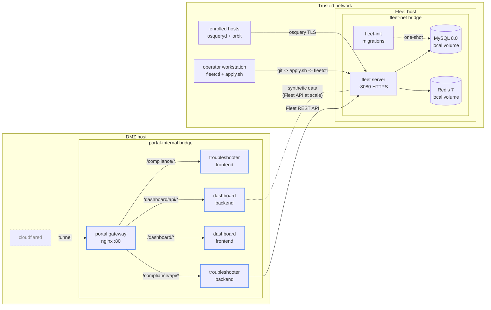

# bread-fleet

> Tooling, automation, and architectural decisions for an enterprise
> Fleet Device Management deployment. Net-new modules built on top of
> the kind of Fleet + GitOps + CIS stack a CPE team already runs.

## Problem

A mature CPE team running Fleet has the basics covered: server up,
osquery agents enrolled, GitOps repo for config, CIS benchmarks
deployed, ABM-driven provisioning. The interesting work is no longer
"how do you stand up Fleet" — it is in the operational gaps that show
up after the basic deployment is healthy.

This repo focuses on four of those gaps:

1. **Support staff can't read SQL or osquery output.** When a device
   fails a CIS policy, the engineering team gets the ticket because
   support has no way to translate "host failed `sshd_config_file_integrity`"
   into "Bob's laptop has the wrong SSH config, here's how to fix it."
   Engineering becomes the bottleneck.

2. **CIS policies don't ship with remediation paths.** The Fleet UI
   says a host is failing a control. Then what? Most teams paste
   manual remediation steps into a wiki and rely on tribal
   knowledge. There's no path from "Fleet says it's broken" to
   "Fleet just fixed it."

3. **No fleet-wide posture visibility over time.** Fleet shows the
   current state per host and per policy. It does not provide
   historical trends, severity-weighted scoring, cross-platform
   comparison, or risk concentration analysis. Leadership and the
   security team cannot answer "are we improving?" or "which 10
   devices account for the most risk?"

4. **Vendor CVE matching lags real-world exploitation.** Fleet's
   built-in vulnerability scanner cross-references installed
   software against the NVD. CISA KEV tracks what's actively being
   exploited *right now*, often days or weeks before the CVE
   appears in vendor feeds. There's no automated bridge between
   "KEV dropped a new entry" and "Fleet is checking my fleet for
   exposure."

## Approach

Build the gap-fillers as separate, opinionated modules. Use Fleet's
existing API and GitOps surface as the substrate. Document every
non-trivial decision as an ADR with explicit alternatives, tradeoffs,
and what changes at scale. No setup guides for things vendor docs
already cover.

## What's in the repo

| Module | Purpose |
|---|---|
| **Compliance Troubleshooter** | React + FastAPI + Claude API tool that translates Fleet policy failures into plain English for support staff, with one-click remediation paths and an audit log. Static fallback dict lets it run without an API key. See [`compliance-troubleshooter/`](compliance-troubleshooter/) and [ADR-0005](docs/adr/0005-compliance-troubleshooter-design.md). |
| **Security Posture Dashboard** | React + Recharts + FastAPI dashboard showing fleet-wide compliance health: weighted risk scoring, 30-day trend with event annotations, platform breakdown, top failing policies, and risk concentration. Uses synthetic data scaled to ~150 devices. See [`security-dashboard/`](security-dashboard/) and [ADR-0007](docs/adr/0007-security-posture-dashboard.md). |
| **Portal Gateway** | nginx reverse proxy serving a landing page at the root and routing each module by path prefix (`/compliance/`, `/dashboard/`). Designed to sit behind a Cloudflare Tunnel with Access email-gate. See [`portal/`](portal/). |
| **Fleet Server Stack** | Docker Compose stack for Fleet, MySQL 8.0, Redis 7, and an optional Cloudflare Tunnel. TLS-terminated on the LAN with a self-signed cert for orbit HTTPS. See [`fleet-server/`](fleet-server/) and ADRs [0001](docs/adr/0001-fleet-deployment-architecture.md)–[0003](docs/adr/0003-lan-only-ingress.md). |
| **Zero-Day Pipeline** | Service that polls CISA KEV, parses indicators of compromise, generates matching osquery SQL, deploys it to Fleet as a policy, and fires a webhook alert when any host matches. Closes the KEV-vs-NVD lag. *(planned)* |
| **CIS demo tooling** | `break.sh` / `restore.sh` pair for deliberately failing 11 CIS Ubuntu controls on a throwaway test host. Used for regression-testing the policy set and live-demoing the compliance dashboard. Three-layer safety gate prevents accidental runs. |
| **GitOps deployment** | Single-file `apply.sh` that scp's the version-controlled YAML to the Fleet host, sources runtime secrets from a gitignored `.env`, and runs `fleetctl gitops`. Templated env-var substitution keeps secrets out of the repo. |
| **Baseline content** | 13 osquery queries and 12 CIS Ubuntu 24.04 policies in `gitops/default.yml`. Warn-only posture with conditional logic that handles both rsyslog and journald-only hosts. The CIS 4.2.3 query in particular went through one round of "the original SQL was too strict, here's what the spec actually accepts" and is documented as a debugging story. |

## Architecture

The left side is the portal stack: an nginx gateway that routes
each module by path prefix, with the Compliance Troubleshooter
talking to the real Fleet instance and the Security Dashboard
serving synthetic data. The right side is the Fleet infrastructure.
cloudflared tunnels external traffic to the portal, which is the
only container exposed outside the internal bridge.

## Architectural Decision Records

| ADR | Decision | Status |
|---|---|---|
| [0001](docs/adr/0001-fleet-deployment-architecture.md) | Fleet deployment architecture: Docker Compose, single host, NAS-backed config, one-shot migration service | Accepted (partially superseded by 0002 and 0003) |
| [0002](docs/adr/0002-mysql-redis-on-local-volumes.md) | MySQL and Redis state on local Docker volumes, not NFS, due to root_squash incompatibility | Accepted |
| [0003](docs/adr/0003-lan-only-ingress.md) | LAN-only ingress with documented at-scale path-restricted Cloudflare Tunnel design | Accepted |
| [0004](docs/adr/0004-fleet-free-single-tenant-design.md) | Single-tenant GitOps shape on Fleet Free, with reference-teams kept as Premium-design documentation | Accepted |
| [0005](docs/adr/0005-compliance-troubleshooter-design.md) | Compliance Troubleshooter design (FastAPI + React + Claude API, static fallback for keyless demo, per-policy remediation registry) | Accepted |
| [0006](docs/adr/0006-orbit-capability-reporting-investigation.md) | Orbit capability reporting limits automated remediation (self-signed cert investigation, manual-only workaround) | Accepted |
| [0007](docs/adr/0007-security-posture-dashboard.md) | Security Posture Dashboard with synthetic data (historical trends, weighted scoring, risk concentration) | Accepted |

Each ADR follows a standard template with explicit `Alternatives Considered`,
`Tradeoffs`, and `At Enterprise Scale` sections.

## At enterprise scale

Honest notes on what changes with 1,000+ devices, a team of engineers,
and production SLAs:

- **Apply pipeline becomes CI-driven, not workstation-driven.** The
  `apply.sh` flow is operator-run because Fleet Free does not support
  API-only service accounts (Premium-gated). At scale this would be a
  GitHub Actions job triggered on PR merge, with a real service
  account and an audit trail tied to the PR.

- **Multi-team is mandatory.** This deployment uses the global
  no-team pool because Fleet Free is single-tenant. The team YAMLs
  in `gitops/reference-teams/` are the design that would be applied
  on Premium: separate enrollment secrets, agent options, policy
  scopes, and rollout cadences per device class.

- **Ingress goes through path-restricted public hostnames, not LAN
  binding.** ADR-0003 documents the design: each agent endpoint
  prefix gets its own Cloudflare Tunnel public hostname, the admin
  UI stays on the trusted network, and Cloudflare Access enforces
  SSO on any path that reaches engineering surfaces.

- **The Compliance Troubleshooter MVP becomes a real service with
  an SRE budget.** Audit log writes go to a real datastore (not a
  flat file), Claude API calls hit a versioned prompt template
  with eval coverage, and the remediation actions are gated by a
  policy engine that checks RBAC and approval workflows.

- **The Security Posture Dashboard replaces synthetic data with a
  real aggregation pipeline.** A scheduled job polls Fleet's REST
  API, snapshots per-policy pass/fail counts into a Postgres
  time-series table, and the dashboard queries that instead of
  the in-memory seed data. ADR-0007 documents the full design:
  retention policy, RBAC, threshold alerting, and per-team
  breakdown.

- **Zero-Day Pipeline auto-deployment is gated behind PR review.**
  The current design auto-generates osquery from KEV entries and
  deploys directly. At enterprise scale, the generated query
  becomes a PR to the GitOps repo, runs through the same review
  flow as any other policy change, and is held back from
  production until at least one human approves. False positives
  are too expensive otherwise.

- **CIS posture moves from warn-only to graduated enforcement.**
  The current 12 policies are warn-only because the demonstration
  deployment has no production blast radius. A real team would
  soak each policy for two weeks, then move it through
  informational, warn, and block on a tracked change-management
  cadence with rollback paths.

## License

MIT, see [LICENSE](LICENSE).
